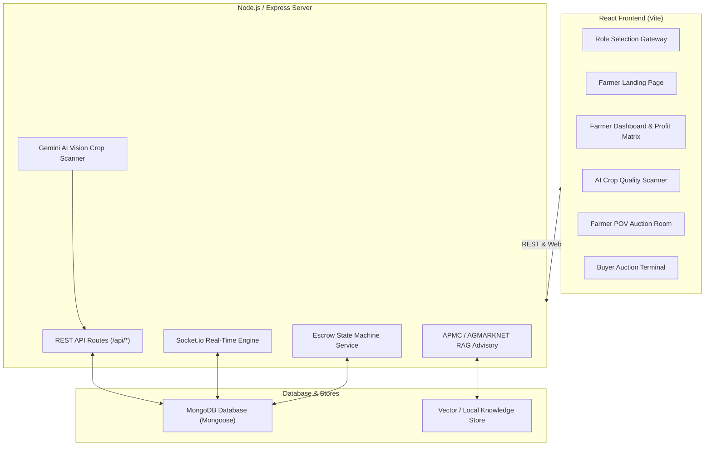

# Keemat Full-Stack Backend Wiring & Data Engine Implementation Plan

Connect the existing Keemat frontend UI screens to a real Node.js/Express backend, MongoDB database, Socket.io live bidding engine, Escrow state machine, and AI Vision / RAG endpoints — with zero placeholder functions, zero mock data, and zero UI/UX layout modifications.

---

## Technical Architecture Overview



---

## 1. MongoDB Data Layer Models

We will build Mongoose models in `server/models/` for full data persistence:

### `User.js`
- `name`: String
- `role`: Enum `['farmer', 'buyer', 'admin']`
- `phone` / `email`: String
- `location`: `{ village, tehsil, district, state, coordinates: [lng, lat] }`
- `kycVerified`: Boolean
- `bankAccount`: `{ accountNumber, ifsc, bankName, accountHolderName }`
- `escrowBalance`: Number
- `rating`: Number

### `Listing.js` (Crop Lot)
- `lotId`: String (e.g. `KM-8802`)
- `seller`: ObjectId (ref `User`)
- `commodity`: String (e.g. `Wheat - Sharbati`)
- `quantityQuintals`: Number (e.g. `100`)
- `originLocation`: String (e.g. `Sehore, Madhya Pradesh`)
- `pickupDate`: Date
- `grade`: String (`Grade A`, `Grade B`, `Grade C`)
- `aiConfidence`: Number (`89`)
- `qualityMetrics`: `{ moisture, foreignMatter, defectDiscoloration, uniformityIndex, testWeight }`
- `defectBoxes`: Array of bounding box objects `{ x, y, w, h, color, type, label }`
- `samplePhotos`: Array of photo URLs
- `marketValuationMin`: Number (`2350`)
- `marketValuationMax`: Number (`2400`)
- `reservePrice`: Number (`2300`)
- `status`: Enum `['draft', 're_grade_requested', 'active_auction', 'auction_closed', 'escrow_locked', 'dispatched', 'delivered', 'cancelled']`
- `auctionStartTime`: Date
- `auctionEndTime`: Date
- `winningBid`: ObjectId (ref `Bid`)
- `winningBuyer`: ObjectId (ref `User`)

### `Bid.js`
- `lot`: ObjectId (ref `Listing`)
- `bidder`: ObjectId (ref `User`)
- `buyerName`: String
- `buyerCity`: String
- `buyerRating`: Number
- `amountPerQuintal`: Number
- `totalGrossValue`: Number
- `timestamp`: Date
- `status`: Enum `['active', 'outbid', 'accepted', 'rejected', 'winning']`

### `EscrowTransaction.js`
- `transactionId`: String (e.g. `ESC-99401`)
- `lot`: ObjectId (ref `Listing`)
- `buyer`: ObjectId (ref `User`)
- `seller`: ObjectId (ref `User`)
- `grossAmount`: Number
- `buyerDepositAmount`: Number
- `transportCost`: Number
- `platformFee`: Number
- `netSellerPayout`: Number
- `landedCostPerQuintal`: Number
- `status`: Enum `['PENDING_DEPOSIT', 'FUNDS_LOCKED', 'HELD_IN_ESCROW', 'DISPATCH_APPROVED', 'DELIVERY_CONFIRMED', 'FUNDS_RELEASED', 'DISPUTED', 'REFUNDED']`
- `stateHistory`: Array of `{ state, timestamp, triggeredBy, note }`
- `dispute`: ObjectId (ref `Dispute`)

### `Dispute.js`
- `disputeId`: String
- `lot`: ObjectId (ref `Listing`)
- `raisedBy`: ObjectId (ref `User`)
- `type`: Enum `['re_grade_request', 'quality_mismatch', 'delivery_delay', 'non_payment']`
- `reason`: String
- `status`: Enum `['pending_review', 'under_investigation', 'resolved_approved', 'resolved_rejected']`
- `resolutionNote`: String
- `createdAt`: Date

### `ChatSession.js` (RAG Advisor)
- `user`: ObjectId (ref `User`)
- `messages`: Array of `{ sender: 'user' | 'assistant', text: String, timestamp: Date, contextSources: Array }`

---

## 2. Escrow State Machine Logic

The Escrow system is implemented as a strict state machine with validation rules:

```
[ PENDING_DEPOSIT ] ──(Buyer locks deposit)──> [ FUNDS_LOCKED ]
                                                      │
                                            (Auction Win / Lock)
                                                      ▼
                                            [ HELD_IN_ESCROW ]
                                                      │
                                            (Dispatch Trigger)
                                                      ▼
                                           [ DISPATCH_APPROVED ]
                                                      │
                                           (Buyer Delivery Sign-off)
                                                      ▼
                                           [ DELIVERY_CONFIRMED ]
                                                      │
                                            (Auto Payout Trigger)
                                                      ▼
                                           [ FUNDS_RELEASED ]

* If dispute raised at any point -> [ DISPUTED ] -> [ REFUNDED ] or [ FUNDS_RELEASED ] after SLA resolution.
```

---

## 3. Real-Time Bid Synchronization (Socket.io)

- Server manages rooms keyed by `lotId`.
- When a buyer clicks **Place Bid** (+15, +50, +100 or custom bid):
  1. Validates buyer escrow deposit status and reserve price condition in DB.
  2. Saves new `Bid` record in MongoDB.
  3. Updates `Listing` winning bid reference.
  4. Emits `new_bid` event to room via Socket.io.
  5. Both Farmer POV (`farmers-pov-bidding`) and Buyer Terminal (`keemat-buyer-auction`) receive live update instantly without polling.
  6. Landed Cost Engine & Net Profit Calculator auto-recalculate live.

---

## 4. AI Services & Backend Endpoints

### AI Crop Quality Scanner (`/api/ai/crop-scan`)
- Accepts sample image uploads or image buffer.
- Employs Google Gemini 2.5 Flash vision model API (with heuristic fallback analyzer) to scan image for:
  - Moisture %, Foreign Matter / Husk %, Defect Discoloration %, Uniformity Index %, Hectolitre Test Weight.
  - Generates defect bounding boxes `[{ x, y, w, h, color, type, label }]`.
  - Determines Grade A / B / C, confidence score (e.g. 89%), and market valuation range.

### AI RAG Advisory Assistant (`/api/ai/rag-advisory`)
- Vector store / TF-IDF similarity index loaded with real AGMARKNET mandi rates, APMC toll structures, logistics tariffs, and crop quality guidelines.
- Provides intelligent net profit advice, transport cost calculations, and dispute resolution guidance.

---

## 5. Directory & File Restructuring Plan

We will consolidate all 5 UI Vite subfolders and the loose `.jsx` component into a single, unified full-stack application while preserving 100% of the UI styling, components, and layout:

```
c:\Users\ADMIN\OneDrive\Desktop\keemat\
├── package.json               # Unified root scripts & dependencies
├── vite.config.ts             # Vite configuration with API proxy to port 5000
├── index.html                 # Main HTML template with Google Fonts (DM Sans, Inter, Space Grotesk, JetBrains Mono)
├── server/                    # Node.js Express & Socket.io Backend
│   ├── config/
│   │   └── db.js              # MongoDB connection
│   ├── models/
│   │   ├── User.js
│   │   ├── Listing.js
│   │   ├── Bid.js
│   │   ├── EscrowTransaction.js
│   │   ├── Dispute.js
│   │   └── ChatSession.js
│   ├── routes/
│   │   ├── authRoutes.js
│   │   ├── listingRoutes.js
│   │   ├── bidRoutes.js
│   │   ├── escrowRoutes.js
│   │   ├── disputeRoutes.js
│   │   └── aiRoutes.js
│   ├── services/
│   │   ├── escrowStateMachine.js
│   │   ├── aiVisionService.js
│   │   ├── ragAdvisoryService.js
│   │   └── socketService.js
│   ├── data/
│   │   └── agmarknet_knowledge.json
│   └── index.js               # Server entry point (Express + Socket.io)
└── src/                       # Frontend Application
    ├── components/
    │   ├── RoleSelectionGateway.tsx
    │   ├── FarmerLanding.tsx
    │   ├── FarmerDashboard.tsx
    │   ├── FarmerCropGrading.tsx
    │   ├── FarmerAuctionRoom.tsx
    │   └── BuyerAuctionTerminal.tsx
    ├── services/
    │   ├── api.ts             # Axios / Fetch client connected to backend REST API
    │   └── socket.ts          # Socket.io client setup
    ├── App.tsx                # Seamless Router & State Provider
    └── main.tsx               # Entry point
```

---

## 6. Verification Plan

### Automated & API Verification
- Run database seeding script (`server/scripts/seed.js`) to insert realistic initial users, APMC rate feeds, and demo crop lots (`KM-8802`).
- Test REST endpoints using Node test script:
  - `POST /api/listings` (create lot)
  - `POST /api/listings/:id/bids` (place bid)
  - `POST /api/escrow/:lotId/deposit` (lock escrow)
  - `POST /api/listings/:id/re-grade` (submit dispute)
  - `POST /api/ai/crop-scan` (run vision scanner)
  - `POST /api/ai/rag-advisory` (run RAG prompt query)

### Manual & UI Verification
- Start Node Express server on port 5000 and Vite dev server on port 3000.
- Verify role selection routing and role setup.
- Verify live bidding sync in real time between Farmer POV and Buyer POV browser tabs using Socket.io.
- Verify Escrow state machine transitions from funds locked -> delivery confirmed -> released.
